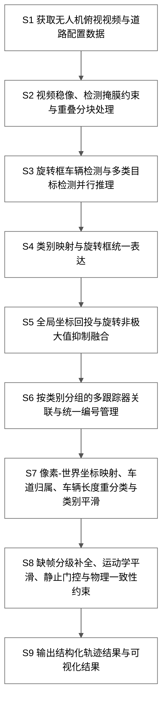
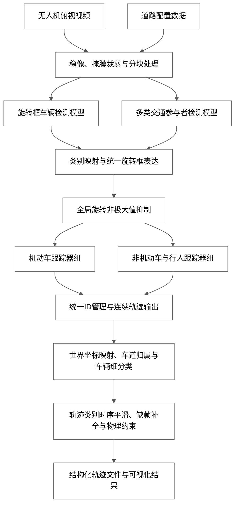
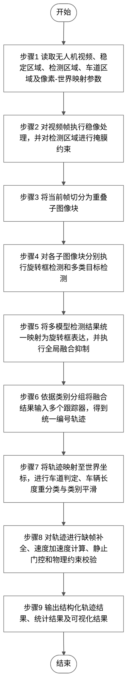

# OpenVTER 专利流程图候选稿

以下流程图基于项目真实实现链路整理，适合作为专利摘要附图或说明书附图初稿。

依据的核心实现包括：
- 视频主流程：`video_inference/video_process.py`
- 融合配置：`config/demo_config/video_config/20220303_5_E_300_fusion_yolov5.json`
- 道路配置解析：`utils/config.py`
- 轨迹补全与物理约束后处理：`using/track_gap_fill_export.py`

建议附图风格：
- 使用黑白线框
- 每个框内尽量控制在 10-22 字
- 摘要附图优先保留主链路，不展开参数和公式

## 方案A：摘要附图紧凑纵向版

适用场景：摘要页右侧，信息密度适中，最接近常见专利摘要附图。

## 方案B：摘要附图分支融合版

适用场景：强调“多模型融合”这一创新点，更适合突出你的发明标题。

## 方案C：方法总流程步骤版

适用场景：作为说明书中的“图1 方法总体流程图”，步骤编号更强，便于后续扩写权利要求。

## 推荐意见

- 如果你现在是为了补摘要右侧的小流程图，优先选“方案A”。
- 如果你想强调本发明区别于传统“单检测器+单跟踪器”的创新点，优先选“方案B”。
- 如果你后面还要继续写说明书附图说明和实施方式，建议把“方案C”作为图1的基础版本。
